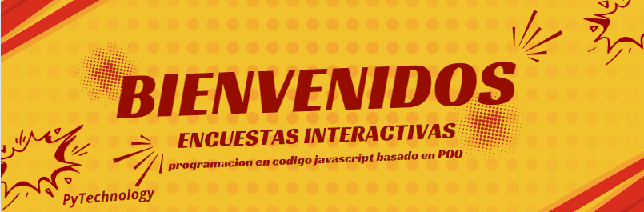

# Encuestas Interactivas

Este programa en codigo JavaScript, basado el programacion orientada a objetos (POO) que te permite gestionar encuestas de forma interactiva. Puedes crear nuevas encuestas, mostrar las existentes, votar en ellas, ver los resultados y eliminar encuestas.

## Funcionalidades

- **Crear Encuesta:** Permite crear una nueva encuesta con un nombre y un numero de preguntas definido por el usuario.
- **Mostrar Encuestas:** Muestra todas las encuestas disponibles.
- **Votar en una Encuesta:** Permite votar en una encuesta seleccionada, seleccionando las respuestas para cada pregunta.
- **Mostrar Resultados:** Muestra los resultados de una encuesta seleccionada, mostrando el numero de votos por opcion para cada pregunta.
- **Eliminar Encuesta:** Permite eliminar una encuesta seleccionada.

## Instrucciones de Uso

1. Ejecuta el programa en un entorno que admita JavaScript, como un navegador web o un entorno de ejecucion de JavaScript como Node.js.
2. Sigue las instrucciones en el menu para interactuar con las diferentes funcionalidades del programa.

## Ejemplo de Uso

```javascript
// Crear una nueva encuesta
menu.crearEncuesta();
// Mostrar las encuestas disponibles
menu.mostrarEncuestas();
// Votar en una encuesta
menu.votarEncuesta();
// Mostrar resultados de una encuesta
menu.mostrarResultados();
// Eliminar una encuesta
menu.eliminarEncuesta();
```
## Extracto de codigo para crear nueva encuesta.

```JavaScript

crearEncuesta() {
      let nombreEncuesta = prompt("Ingrese el nombre de la encuesta:");
      let nuevaEncuesta = new Encuesta(nombreEncuesta);

      let cantPreguntas; // ingresar la cantidad de preguntas que tendra tu encuesta.
      while (true) {
          cantPreguntas = parseInt(prompt("Ingrese la cantidad de preguntas para la nueva encuesta:"));
          if (!isNaN(cantPreguntas) && cantPreguntas > 0) {
              break;
          }
          console.log("Ingrese un numero valido de preguntas.");
      }

      for (let i = 0; i < cantPreguntas; i++) {
          let pregunta; // Ingresar cada pregunta.
          while (true) {
              pregunta = prompt(`Ingrese la pregunta ${i + 1}:`);
              if (pregunta) {
                  break;
              }
              console.log("La pregunta no puede estar vacia.");
          }

          let opciones; // Ingresar las opciones para cada pregunta.
          while (true) {
              opciones = prompt("Ingrese las opciones separadas por comas:").split(",");
              if (opciones.length >= 2) {
                  break;
              }
              console.log("Debe ingresar al menos dos opciones.");
          }

          nuevaEncuesta.agregarPregunta(pregunta, opciones);
      }

      this.encuestas.push(nuevaEncuesta); // Subir la encuesta.
      console.log("Encuesta creada exitosamente.");
  }
```

## Finalizar e iniciar.

Para finalizar el programa solo debes usar la opcion 6 del programa para salir de el.

Para iniciar el programa solo debes escribir en la consola "main()" y vuelve a comenzar.

## Contribuciones

Si deseas contribuir a este proyecto, ¡sientete libre de hacerlo! Simplemente sigue estos pasos:

Haz un fork del repositorio.

Haz clic en el Botón "Fork": En la esquina superior derecha del repositorio, veras un boton llamado "Fork". Haz clic en este boton y GitHub comenzara a crear una copia del repositorio en tu cuenta.

Crea una rama para modificarla a tu gusto (git checkout -b TuRama).
Realiza tus cambios.

Haz commit de tus cambios (git commit -m "mensaje modificaciones o contribuciones / archivo(s) y linea(s)").

Haz push de la rama (git push origin TuRama).

Abre una solicitud de extraccion: En la pagina principal del repositorio en GitHub, cambia a la pestaña "Pull Requests" (Solicitudes de extraccion). Ahi encontraras un boton verde que dice "New pull request" (Nueva solicitud de extraccion). Haz clic en el.

Selecciona la rama del repositorio original en la que deseas fusionar tus cambios y la rama de tu fork que contiene tus cambios.

Una vez que hayas completado todos los detalles, haz clic en el boton verde "Create pull request" (Crear solicitud de extraccion) para enviar tu solicitud de extracción al repositorio original.

Una vez que hayas enviado la solicitud de extraccion, revisare tus cambios para decidir si deseo fusionarlos en el codigo principal.

## Licencia

Este proyecto esta bajo la Licencia MIT.

# ¡Gracias por usar PyTechnology!